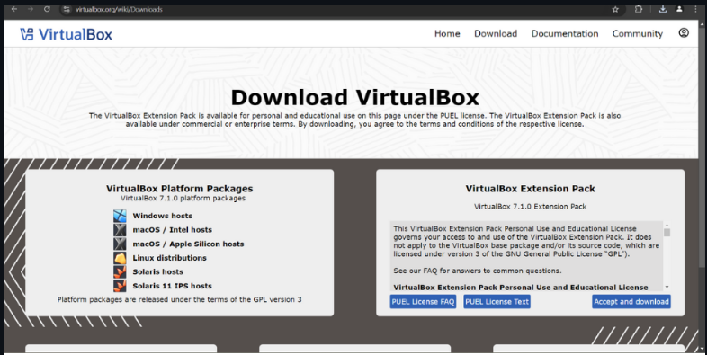
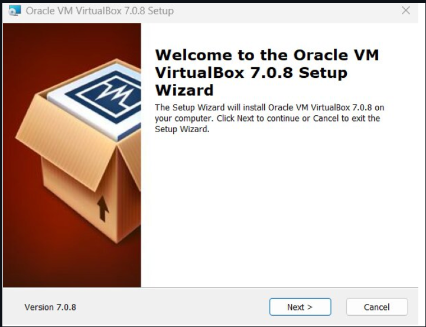
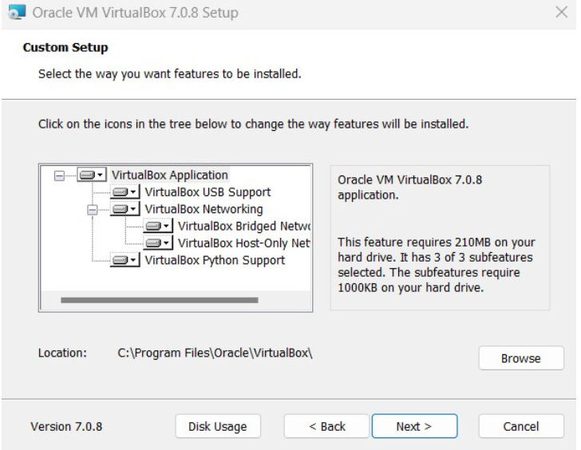
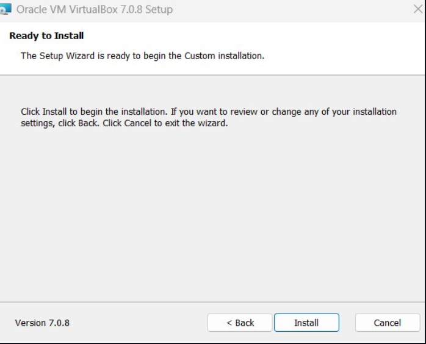
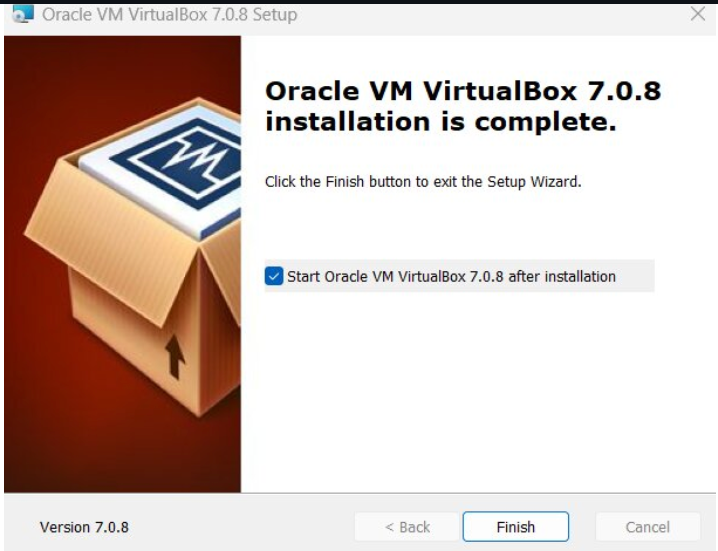
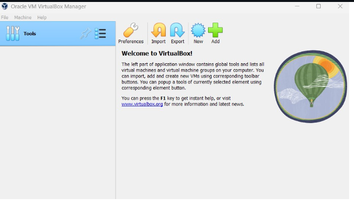
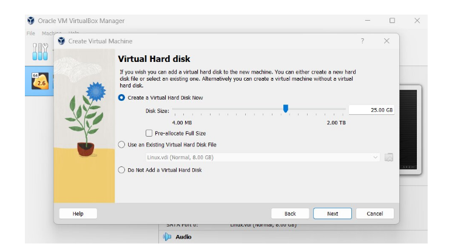

# LAB 1 : INSTALLATION OF LINUX UBUNTU ON VIRTUAL BOX

## WHAT IS LINUX ?
Linux is an open-source operating system kernel that serves as the
foundation for various operating systems, commonly referred to as
Linux distributions (or distros). Developed by Linus Torvalds in
1991, Linux is known for its stability, security, and versatility,
making it popular for servers, desktops, embedded systems, and
more.
## STEP 1 : DOWNLOAD VIRTUALBOX FILE 

    1 Go to the VirtualBox Website

    2 select your operating system

## STEP 2 : INSTALLING VIRTUAL BOX
    
 ### 1 The Beginning

 ### 2 select installation location

 ### 3 Ready to install

 ### 4 Installation complete 

 ### 5 Opening virtualbox

## STEP 3 : INSTALLING LINUX USING VIRTUALBOX
### 1 Naming virtual machine

   After installing virtual box ,click New .

  - Write the Name you want for your system, for example: Ubuntu 24.04 LTS
  - Select Type: Linux.
  - Operating system: ubuntu(64 bit)
  - Select Version: Ubuntu
   

### 2 select the amount of ram

### 3 Hard Disk setting
  Select hard disk setting:

  – Choose ‘Create a virtual hard drive Now’, in order to make a virtual disk space.

  – Select the amount of hard drive size.

  -now you are done with hardware settings.
  

### 4 Launching your System

   Choose the downloaded Linux ISO file:

   – Click Start to launch your system
  
   choose your iso file from your computer
  
### 5 Final installation
 Install Linux and further set the Keyboard and other preferences

### Make your Account:
- Enter your details 

### what are two advantages of installing ubuntu in virtual box?
- Robust snapshot and cloning capabilities
### what are two advantages of dual booting instead of using a vm?
- better perfomance
- full hardware compability and access

# CONGRATULATIONS YOU HAVE SUCCESSFULLY INSTALLED THEUBUNTU LINUX .