# LAB 1 
## Basic Linux Commands
### ✅ 1. **Navigation Commands**

### `pwd` – Print Working Directory

Shows the current location in the filesystem.

```bash
pwd
```

📌 Output example:

```
/Users/yourname/projects
```

### The output of the command is as below -
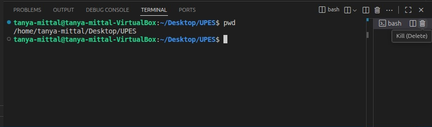

---

### `ls` – List Directory Contents

Lists files and folders in the current directory.

```bash
ls
```

* `ls -l` → Detailed list (permissions, size, date)
* `ls -a` → Shows hidden files (those starting with `.`)
* `ls -la` → Combined

### The output of the command is as below -
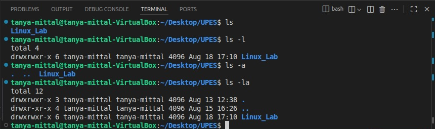

---

### `cd` – Change Directory

Moves into a directory.

```bash
cd Linux_Lab      # Go to Documents
cd ..             # Go up one level
cd /              # Go to root
cd ~              # Go to home directory
```
### The output of the command is as below -
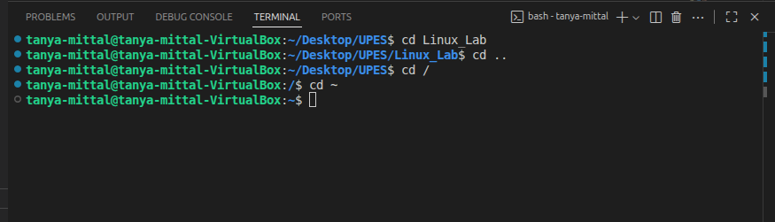

---

## ✅ 2. **File and Directory Management**

### `mkdir` – Make Directory

Creates a new folder.

```bash
mkdir Assignments
```
### The output of the command is as below -
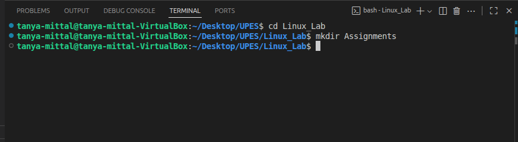
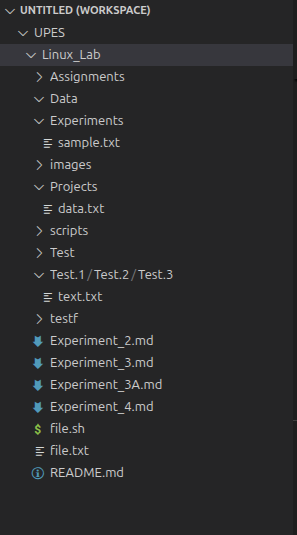

---

### `touch` – Create File

Creates an empty file.

```bash
touch file.txt
```
### The output of the command is as below -
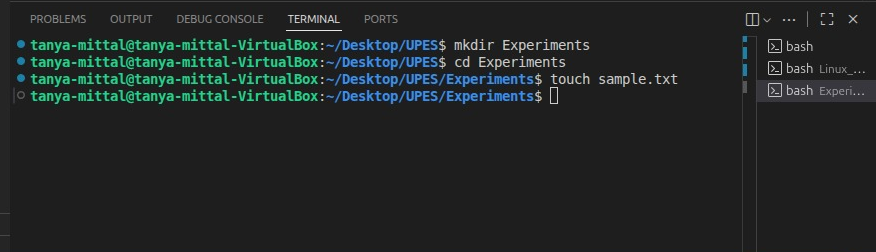

---

###`cp` – Copy Files or Directories

```bash
cp data.txt sample.txt
```

* Copy folder:

```bash
cp -r Data Experiments
```
### The output of the command is as below -
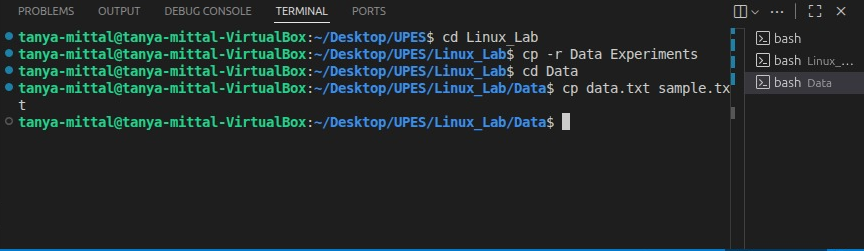

---

### `mv` – Move or Rename Files

```bash
mv data.txt context.txt
```

```bash
mv sample.txt ~/Desktop/UPES/Linux_Lab/Experiments   # Move file
```
### The output of the command is as below -
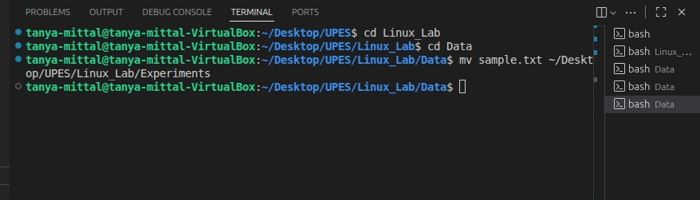

---

### `rm` – Remove Files

```bash
rm context.txt        # Delete file
rm -r Experiments  # Delete folder (recursively)
```
### The output of the command is as below -
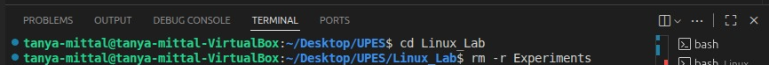
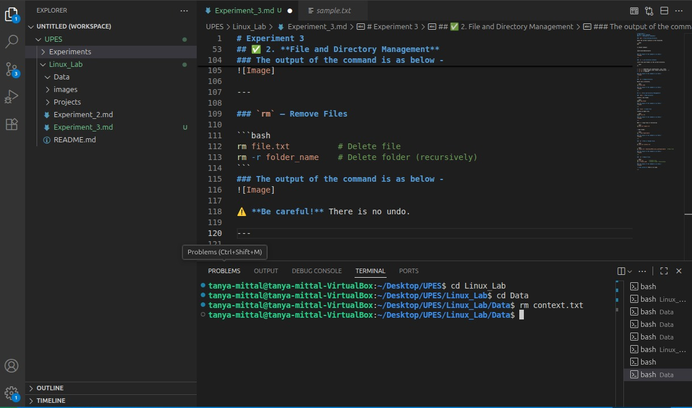

⚠️ **Be careful!** There is no undo.

---

## ✅ 3. **File Viewing & Editing**

### `cat` – View File Contents

Displays content in terminal.

```bash
cat data.txt
```
### The output of the command is as below -
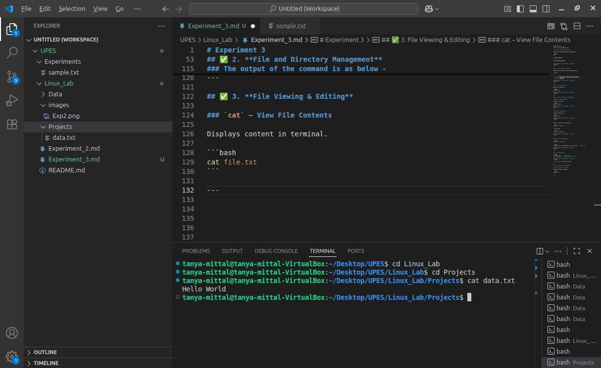

---

### `nano` – Edit Files in Terminal

A basic terminal-based text editor.

```bash
nano data.txt
```

* Use arrows to move
* `CTRL + O` to save
* `CTRL + X` to exit
### The output of the command is as below -
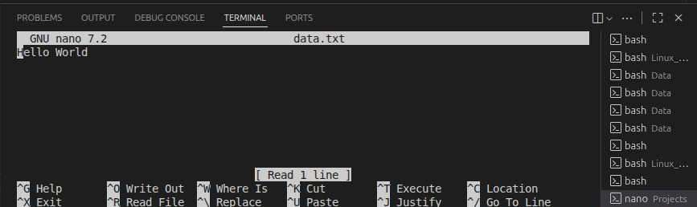

---

### `clear` – Clears the Terminal

```bash
clear
```

Shortcut: `CTRL + L`
### The output of the command is as below -
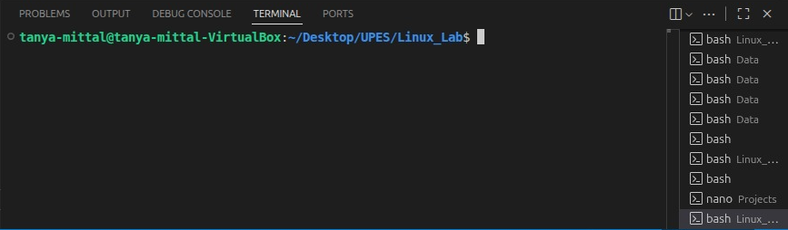

---

## ✅ 4. **System Commands**

### `echo` – Print Text

Useful for debugging or scripting.

```bash
echo "Hello, World!"
```
### The output of the command is as below -
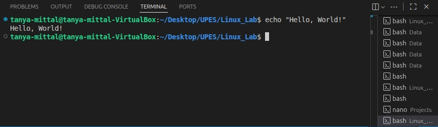

---

### `whoami` – Show Current User

```bash
whoami
```
### The output of the command is as below -
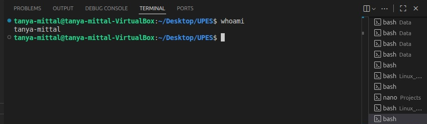

---

### `man` – Manual for Any Command

```bash
man ls
```
### The output of the command is as below -
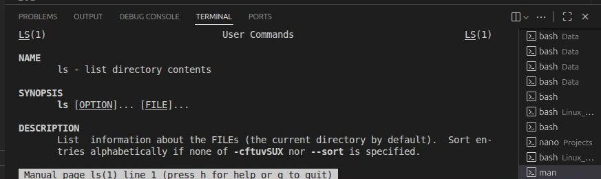

Use `q` to quit the manual.

---

## ✅ 5. **Searching and Finding**

### `find` – Locate Files

```bash
find . -name "*.txt"
```
### The output of the command is as below -
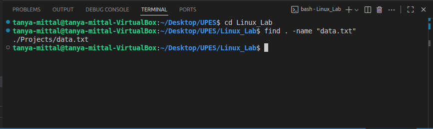

---

### `grep` – Search Inside Files

```bash
grep "Hello" data.txt
```
### The output of the command is as below -
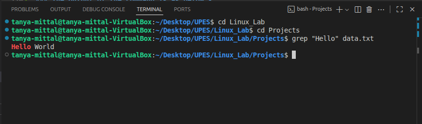

🔍 Searches for the word `Hello` inside `data.txt`.

---

## ✅ 6. **Helpful Shortcuts**

| Shortcut   | Action                      |
| ---------- | --------------------------- |
| `Tab`      | Auto-complete files/folders |
| `↑ / ↓`    | Browse command history      |
| `CTRL + C` | Stop a running command      |
| `CTRL + L` | Clear screen                |

---

## ✅ 7. **Bonus: Chaining Commands**

* **Run multiple commands**:

```bash
mkdir Test && cd Test && touch example.txt
```
### The output of the command is as below -
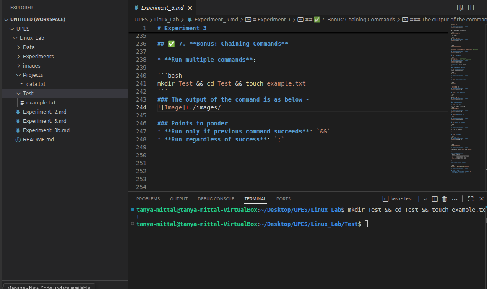

### Points to ponder
* **Run only if previous command succeeds**: `&&`
* **Run regardless of success**: `;`

# Practice for creating user and groups (Lab5_Practice)

### 🔹 1. Create a new user

```bash
sudo useradd -m newuser
```
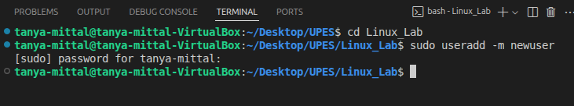
* `-m` → creates a home directory `/home/newuser`.

---

### 🔹 2. Create a new group

```bash
sudo groupadd newgroup
```


### 🔹 3. Add the user to the group

```bash
sudo usermod -aG newgroup newuser
```
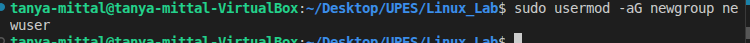
* `-aG` → append user to the supplementary group (doesn’t remove existing groups).

---

### 🔹 4. Create a file (as current user, e.g. root or your login user)

```bash
touch testfile.txt
```

Check ownership:

```bash
ls -l testfile.txt
```

Example:


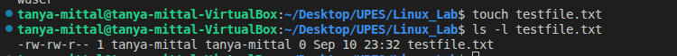

---

### 🔹 5. Assign ownership of the file to `newuser` and `newgroup`

```bash
sudo chown newuser:newgroup testfile.txt
```

---

### 🔹 6. Verify ownership

```bash
ls -l testfile.txt
```

Output:

```
-rw-r--r-- 1 newuser newgroup 0 Aug 19 14:02 testfile.txt
```

---

## Q1 What is the difference between chmod and chown?
### A1 ✅ 🔑 chmod (change mode)

Purpose: Changes the permissions (read, write, execute) of a file or directory.

Who can use it: The file’s owner or superuser (root).

Example:

chmod 755 file.txt


→ This gives owner full permissions (rwx), and others only read + execute (r-x).

👤 chown (change owner)

Purpose: Changes the owner (user) and/or group of a file or directory.

Who can use it: Only the superuser (root).
Example:

sudo chown newuser:newgroup file.txt


→ This makes newuser the owner and newgroup the group of file.txt.

⚡ Key Difference

chmod → What people can do with a file (permissions).

chown → Who owns the file (ownership).

👉 Think of it like this:

chown = change the person holding the keys 🔑

chmod = change what the keys can unlock 🚪

## Q2 How do you check current directory and user?
### A2 🎯 Use pwd to check current directory and whoami to see current user.


