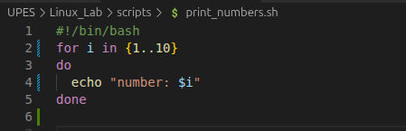
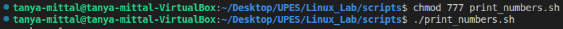
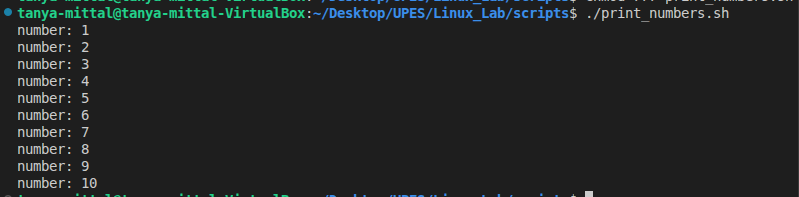
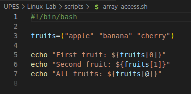
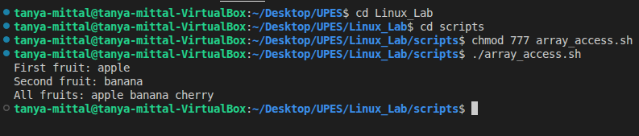

# Script Execution 

## 1. Script: print _numbers.sh
### Purpose
-This script prints numbers from 1 to 10 using a loop.

### Code 


### line-by-line explanation

- #!/bin/bash-shebang, tells the system to run the script with the bash shell.
- # script to print numbers from 1 to 10 - A comment describing the script.
- for i in {1..10} - Loop from 1 through 10 ,assigning each value to variable i.
- do - Marks the beginning of commands inside the loop.
- echo "number: $i" - Prints the current number with a label.
- done - marks the end of the loop.

### To Run 


- Chmod 777 print_numbers.sh - Gives all the acccess
- ./print_numbers.sh - Runs the script

### Example Run


## 2. Script: array_access.sh

### Purpose
-This script loops through an array of names and prints each one.

### Code 


### line-by-line explanation

1. 
```bash
#!/bin/bash
```

- This is called a shebang.
- It tells the system: “Run this script using the Bash shell (located at /bin/bash).

2. 
```bash
fruits=("apple" "banana" "cherry")
```

- Here, we are creating an array named fruits.
-  The array has 3 elements: "apple", "banana", and "cherry".
- In Bash, arrays are written with () and values are separated by spaces.

3. 
```bash
echo "First fruit: ${fruits[0]}"
```
- echo prints text to the terminal.
- ${fruits[0]} means: “get the first element of the array fruits”.
- Arrays in Bash start at index 0.
- So this prints:
 First fruit: apple

4. 
```bash
echo "Second fruit: ${fruits[1]}"
```

- Same idea as above, but ${fruits[1]} means the second element.
- This Prints 
 Second fruit: banana

5. 
```bash
echo "All fruits: ${fruits[@]}"
```

- ${fruits[@]} means: “all elements of the array”.
- So it prints everything:
 All fruits: apple banana cherry


### Example Run



### Question

Question-1. How do you make a script executable?
Answer-1 .chmod +x print_numbers.sh