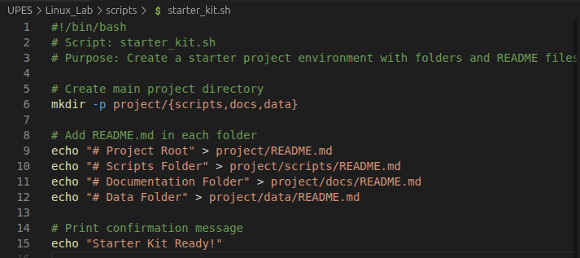

# LAB 5 (Starter Kit)

## Script : starter_kit.sh


- "#!/bin/bash → Shebang line. It tells the system to use bash to execute this script.
- Comments (# ...) → Explain what the script does (not executed)"
- "mkdir" = “make directory.”
- -p = creates parent directories only if they don’t exist, preventing errors.
- project/{scripts,docs,data} uses brace expansion to create:

project/scripts/

project/docs/

project/data/
(All inside the project/ folder).
-  "echo "text" prints text.
- .>	⁠redirects the output into a file. If the file doesn’t exist, it creates it; if it exists, it overwrites it.

- Example:
 .echo "# Project Root" > project/README.md creates a file called README.md in the project/ folder with the heading “# Project Root”.

## output


## Extra Questions 

### Why is automation useful in DevoPs?
- Consistency and Reliablility
- Speed and efficiency
- Scalability
- Reduced Human Error 

### what does mkdir -p do?

- "mkdir"= “make directory.”
- -p = creates parent directories only if they don’t exist, preventing errors.

# LAB Extra – Starter Kit & Automation

## Purpose of the Script

- The script ⁠ starter_kit.sh ⁠ is designed to automate the creation of a starter project environment.  
- It ensures a consistent folder structure (⁠ scripts/ ⁠, ⁠ docs/ ⁠, ⁠ data/ ⁠) under the ⁠ project/ ⁠ directory and places placeholder ⁠ README.md ⁠ files inside each folder.  
- This helps developers begin with an organized workspace without manually creating directories.

### Command:

```bash
bash starter_kit.sh"
```