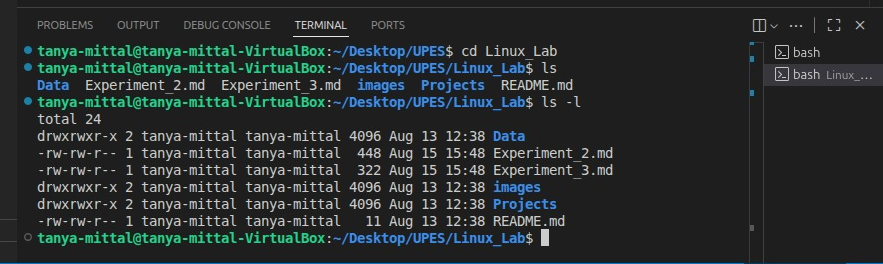
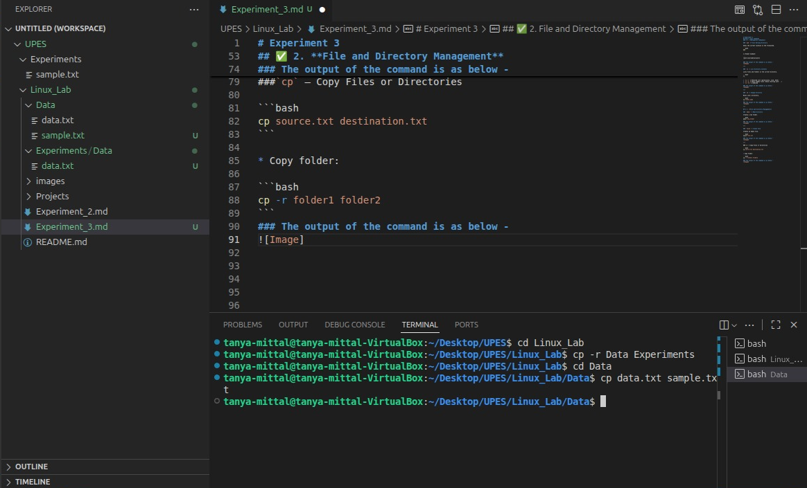

# Experiment 3
## Basic Linux Commands
### ✅ 1. **Navigation Commands**

### `pwd` – Print Working Directory

Shows the current location in the filesystem.

```bash
pwd
```

📌 Output example:

```
/Users/yourname/projects
```

### The output of the command is as below -


---

### `ls` – List Directory Contents

Lists files and folders in the current directory.

```bash
ls
```

* `ls -l` → Detailed list (permissions, size, date)
* `ls -a` → Shows hidden files (those starting with `.`)
* `ls -la` → Combined

### The output of the command is as below -


---

### `cd` – Change Directory

Moves into a directory.

```bash
cd folder_name
```
### The output of the command is as below -


---

## ✅ 2. **File and Directory Management**

### `mkdir` – Make Directory

Creates a new folder.

```bash
mkdir new_folder
```
### The output of the command is as below -


---

### `touch` – Create File

Creates an empty file.

```bash
touch file.txt
```
### The output of the command is as below -


---

###`cp` – Copy Files or Directories

```bash
cp data.txt sample.txt
```

* Copy folder:

```bash
cp -r Data Experiments
```
### The output of the command is as below -


---

### `mv` – Move or Rename Files

```bash
mv data.txt context.txt
```

```bash
mv sample.txt ~/Desktop/UPES/Linux_Lab/Experiments   # Move file
```
### The output of the command is as below -


---

### `rm` – Remove Files

```bash
rm context.txt        # Delete file
rm -r Experiments  # Delete folder (recursively)
```
### The output of the command is as below -


⚠️ **Be careful!** There is no undo.

---

## ✅ 3. **File Viewing & Editing**

### `cat` – View File Contents

Displays content in terminal.

```bash
cat data.txt
```
### The output of the command is as below -


---

### `nano` – Edit Files in Terminal

A basic terminal-based text editor.

```bash
nano data.txt
```

* Use arrows to move
* `CTRL + O` to save
* `CTRL + X` to exit
### The output of the command is as below -


---

### `clear` – Clears the Terminal

```bash
clear
```

Shortcut: `CTRL + L`
### The output of the command is as below -


---

## ✅ 4. **System Commands**

### `echo` – Print Text

Useful for debugging or scripting.

```bash
echo "Hello, World!"
```
### The output of the command is as below -


---

### `whoami` – Show Current User

```bash
whoami
```
### The output of the command is as below -


---

### `man` – Manual for Any Command

```bash
man ls
```
### The output of the command is as below -


Use `q` to quit the manual.

---

## ✅ 5. **Searching and Finding**

### `find` – Locate Files

```bash
find . -name "*.txt"
```


