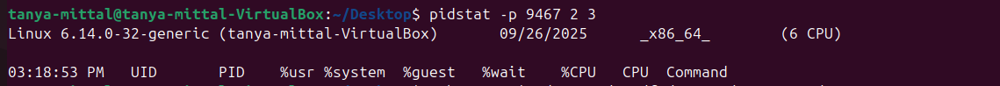

## 🐧 Linux Process Management 

It covers essential Linux commands for monitoring and managing processes.
Each section explains what the command does, why it’s useful, and includes examples.

### 📑 Table of Contents

- 🔍 Show All Processes (ps aux)
- 🌲 Process Tree (pstree -p)
- 📊 Real-Time Monitoring (top)
- ⚡ Adjust Process Priority (nice, renice)
- 🧩 CPU Affinity (taskset)
- 📂 I/O Scheduling Priority (ionice)
- 📑 File Descriptors (lsof)
- 🐛 Trace System Calls (strace)
- 📡 Find Process Using a Port (fuser)
- 📊 Per-Process Statistics (pidstat)
- 🔐 Control Groups (cgroups)

#### 1. 🔍 Show All Processes

```bash
ps aux
```

- Options:
   - a → show processes for all users
   - u → show the user/owner of the process
   - x → show processes not attached to a terminal

- "ps aux" It list all the running commands on system includinng system daemons

#### Output 


- 👉 Useful for system monitoring, troubleshooting high CPU/memory usage, or finding PIDs.

#### 2. 🌲 Process Tree

```bash
pstree -p
```

- It Shows processes in a hierarchical tree structure.
- It Helps understand parent-child relationships.

#### Output


👉 Great for debugging orphan processes (An orphan process is a process whose parent has terminated (exited) while the child is still running.), or seeing how daemons and shells are linked.

#### 3. 📊 Real-Time Monitoring

```bash
top
```

- Interactive command to monitor CPU, memory, and tasks in real time.
- Navigation:
    - Press q → quit
    - Press k → kill a process
    - Press h → help

#### Output  


#### 4.(1) ⚡ Adjust Process Priority

- Start a process with priority

```bash
nice -n 10 sleep 300 &
```

- -n 10 → sets nice value = 10 (lower priority).
- Background job [1] 9467 created.

#### Output


#### 4. (2) Change priority of running process

```bash
renice -n -5 -p 9467
```

- Used when you want critical tasks to run faster or background jobs to run slower.

#### Output 


#### 5. 🧩 CPU Affinity (Bind Process to CPU Core)
taskset -cp 3050


Purpose: Shows CPU cores a process can use.

Output:

pid 3050's current affinity list: 0-3


Restrict to core 1:

taskset -cp 1 3050


Output:

pid 3050's current affinity list: 1


👉 Useful in performance tuning, ensuring tasks run on specific cores.

6. 📂 I/O Scheduling Priority
ionice -c 3 -p 3050


Purpose: Controls disk I/O priority of a process.

-c 3 = idle class → process gets I/O only when the system is idle.

Output:

successfully set pid 3050's IO scheduling class to idle


👉 Prevents background jobs (like backups) from slowing down disk access.

#### 7. 📑 File Descriptors Used by a Process

lsof -p 3050 | head -5


Purpose: Lists files opened by a process.

Use Case: Check which files, sockets, or devices a process is using.

#### Output 


8. 🐛 Trace System Calls of a Process
strace -p 3050


Purpose: Attaches to a process and shows system calls.

Use Case: Debugging programs by checking file, network, and system interactions.

9. 📡 Find Process Using a Port
sudo fuser -n tcp 8080


Purpose: Find which process is bound to a TCP/UDP port.

Use Case: Debugging web servers, databases, or services.


👉 PID 4321 is using port 8080.

10. 📊 Per-Process Statistics
pidstat -p 3050 2 3


- It displays detailed CPU usage for a process over time.
    - 2 = interval (seconds)
    - 3 = number of reports

#### Output


- 👉 It is usually considered better than top when monitoring one specified process

11. 🔐 Control Groups (cgroups) for Resource Limits

Purpose: Limit CPU, memory, or I/O resources for a process or group of processes.

Create a cgroup:

sudo cgcreate -g cpu,memory:/testgroup


Limit CPU and Memory:

echo 50000 | sudo tee /sys/fs/cgroup/cpu/testgroup/cpu.cfs_quota_us
echo 100M   | sudo tee /sys/fs/cgroup/memory/testgroup/memory.limit_in_bytes


Add process (PID 3050) to cgroup:

echo 3050 | sudo tee /sys/fs/cgroup/cpu/testgroup/cgroup.procs


👉 Ensures processes don’t hog system resources (useful in servers & containers).