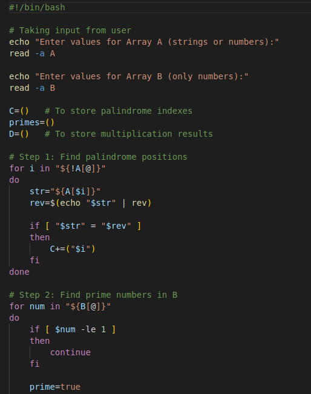
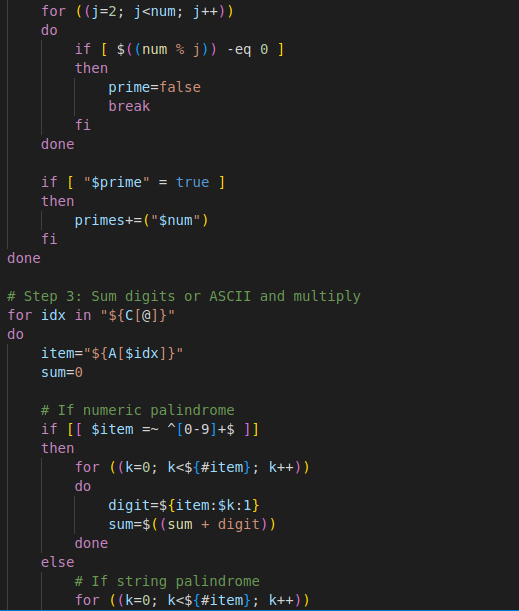
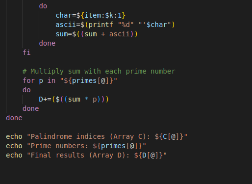

### Assessment 1

### Code 

### Line By Line Explanation

1. #!/bin/bash
-  Declares the script should run under the Bash shell.

2. echo "Enter values for Array A (strings or numbers):"
-  Prints a prompt asking the user to enter values for Array A.

3. read -a A
-  Reads space-separated input from the user into the Bash array A.

4. "Enter values for Array B (only numbers):"
Prints a prompt asking the user to enter values for Array B.

5. read -a B
-  Reads space-separated input into the Bash array B.

6. C=()
-  Creates an empty array C to hold indices of palindromes found in A.

7. primes=()
-  Creates an empty array primes to store prime numbers found in B.

8. D=()
-  Creates an empty array D to store final multiplication results.

9. for i in "${!A[@]}"
-  Starts a loop over the indices of array A. ${!A[@]} expands to all indices.

10. str="${A[$i]}"
-  Assigns the element at index i of A to variable str.

11. rev=$(echo "$str" | rev)
-  Reverses the string str using the rev command and stores the reversed value in rev.

12. if [ "$str" = "$rev" ] … C+=("$i")
-  Compares str with its reverse. If equal, the element is a palindrome and its index i is appended to array C.

13. for num in "${B[@]}"
-  Starts a loop over each value num in array B.

14. if [ $num -le 1 ] … continue
-  Skips numbers less than or equal to 1 since they are not prime.

15. prime=true
-  Assumes num is prime until shown otherwise.

16. for ((j=2; j<num; j++))
-  Loops j from 2 up to num-1 to test divisibility.

17. if [ $((num % j)) -eq 0 ] … prime=false; break
-  If num is divisible by j, mark it not prime and exit the inner loop early.

18. if [ "$prime" = true ] … primes+=("$num")
-  If the flag remained true after testing, append num to array primes.

19. for idx in "${C[@]}"
-  Starts a loop over each palindrome index stored in C.

20. item="${A[$idx]}"
-  Fetches the palindrome value from A at index idx into item.

21. sum=0
-  Initializes sum to zero for accumulating digits or ASCII values.

22. if [[ $item =~ ^[0-9]+$ ]]
-  Tests whether item contains only digits (numeric palindrome).

23. Numeric branch: loop over digits, digit=${item:$k:1} then sum=$((sum + digit))
- Iterates through each character of the numeric string, converts to a digit, adds it to sum.

24. String branch: loop over characters, char=${item:$k:1} then ascii=$(printf "%d" "'$char") and sum=$((sum + ascii))
-  For non-numeric palindromes, extract each character, convert to ASCII code using printf, and add that code to sum.

25. for p in "${primes[@]}" … D+=($((sum * p)))
-  For each prime in primes, multiply the computed sum by the prime p and append the product to array D.

26. echo "Palindrome indices (Array C): ${C[@]}"
-  Prints the list of palindrome indices found in A.

27. echo "Prime numbers: ${primes[@]}"
-  Prints the prime numbers found in B.

28. echo "Final results (Array D): ${D[@]}"
-  Prints all multiplication results stored in D.

### Output:

