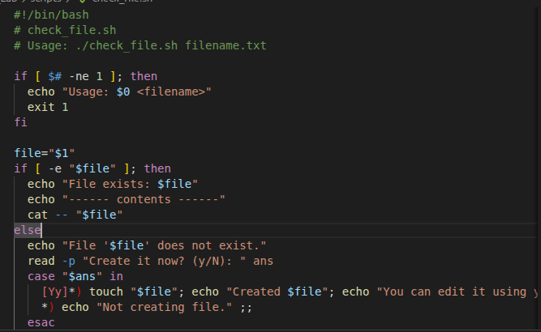
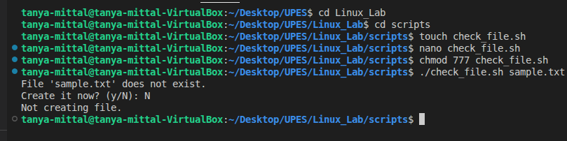

## Check file permission 

### Code

### Line by Line Explanation
- #!/bin/bash — Shebang: tells the OS to run this script with /bin/bash (the Bash shell).

- "# check_file.sh"— Comment: a short name/description of the file (ignored by the shell).

- "# Usage: ./check_file.sh filename.txt" — Comment: shows how to call the script (helpful for users).

- " if [ $# -ne 1 ]; then " — Start an if that checks the number of positional arguments: $# is the count of arguments; -ne 1 means “not equal to 1”. If the script was not given exactly one argument, the then block runs.

- echo "Usage: $0 <filename>" — Print a usage message. $0 expands to the script name (how it was invoked).

- exit 1 — Exit the script with status 1 (conventional non-zero exit code means an error).

- fi — End of the if block.

- file="$1" — Save the first positional argument ($1) into the variable file. Quotes around "$1" preserve spaces and special characters.

- if [ -e "$file" ]; then — Test whether the path in $file exists (-e is true for files, directories, symlinks, etc.). If it exists, run the then block. (Use -f if you specifically want a regular file.)

-  echo "File exists: $file" — Inform the user that the file exists.

- echo "------ contents ------" — A visual separator before printing the file contents.

- cat -- "$file" — Print the file contents to stdout. The -- stops option parsing (so filenames starting with - won’t be treated as options); quoting "$file" protects spaces/newlines in the filename.

- else — Otherwise (the file does not exist), run the following block.

- echo "File '$file' does not exist." — Inform the user the file was not found.

- read -p "Create it now? (y/N): " ans — Prompt the user and read their answer into variable ans. -p supplies the prompt text. The prompt shows (y/N) indicating the default/expected choice is No.

- case "$ans" in — Start a case statement to branch based on the user's response (pattern matching).

- [Yy]*) touch "$file"; echo "Created $file"; echo "You can edit it using your favorite editor." ;; — If the answer begins with Y or y ([Yy]* matches Y, y, Yes, yep, etc.), run the commands separated by ;: touch creates an empty file (or updates its timestamp), then print confirmation messages. ;; ends this case branch.

- *) echo "Not creating file." ;; — Default branch (* matches anything else): print that the file will not be created.

- esac — End the case statement.

- fi — End the outer if (the if [ -e ... ] block).

### Output

