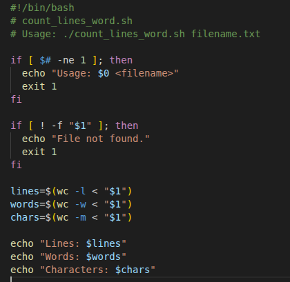
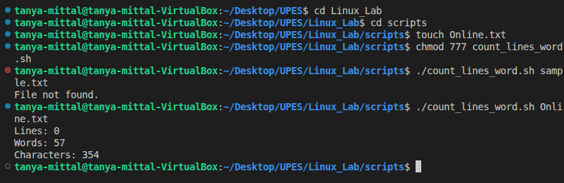

## Count_Line_Word

### Code

### Line By Line Explanation

- #!/bin/bash
This is called a shebang. It tells the operating system which interpreter to use for executing the script. In this case, it specifies the Bash shell located at /bin/bash.

- "# count_lines_word.sh"
This is a comment. It's a non-executable line used to provide a brief description of the script's purpose.

- "# Usage: ./count_lines_word filename.txt"
Another comment explaining the correct way to run the script from the command line, which is ./count_lines_word.sh followed by the name of the file you want to analyze.

- if [ $# -ne 1 ]; then
This line begins an if statement. It checks if the number of command-line arguments is not equal to 1. $# is a special variable that holds the number of arguments passed to the script.

- echo "Usage: $0 <filename>"
If the if condition is true (meaning the user didn't provide exactly one argument), this command prints a usage message to the terminal, instructing the user on the correct format.

- exit 1
This command terminates the script's execution and returns a status code of 1, which typically indicates an error.

- fi
This marks the end of the if statement.

- if [ ! -f "$1" ]; then
This is another if statement. It checks if the first command-line argument ($1) is not a regular file. The -f operator tests if a file exists and is a regular file, and the ! negates the condition.

- echo "File not found."
If the file doesn't exist, this command prints an error message to the terminal.

- exit 1
This command terminates the script with an error status.

- fi
This marks the end of the second if statement.

- lines=$(wc -l < "$1")
This line uses command substitution to execute the wc command and stores its output in the lines variable. wc -l counts the number of lines. The < is an input operator that tells wc to read from the specified file ($1). The double quotes around $1 are important to handle names with spaces.

- words=$(wc -w < "$1")
Similar to the previous line, this counts the number of words in the file using wc -w and stores the result in the words variable.

- chars=$(wc -m < "$1")
Again, this counts the number of characters in the file using wc -m and stores the result in the chars variable.

- echo "Lines: $lines"
This command prints the value of the lines variable to the terminal, prefixed with the label "Lines: ".

- echo "Words: $words"
This command prints the value of the words variable to the terminal, prefixed with the label "Words: ".

- echo "Characters: $chars"
This command prints the value of the chars variable to the terminal, prefixed with the label "Characters: ".

### Output 

