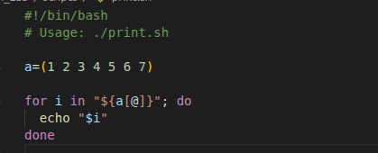
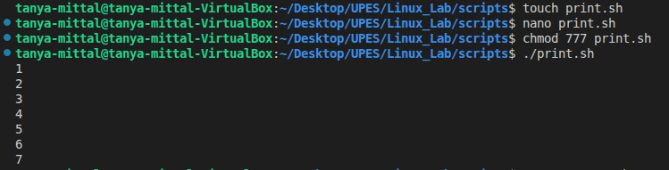

## Print Numbers

### Code

### Line by line Explnation

- #!/bin/bash
This is known as a shebang. It's the first line of the script and tells the operating system which interpreter to use to execute the file. In this case, it specifies the Bash shell.

- "# Usage: ./print.sh"
This is a comment. It's not executed by the script but provides information,explaining how to run the script from the command line.

- a=(1 2 3 4 5 6 7)
This line initializes an array named a and assigns it the integer values from 1 to 7. In bash, arrays are a simple way to store multiple values in a single variable.

- for i in "${a[@]}"; do
This starts a for loop. It's designed to iterate over each element of the array a. Let's break down the key components:
1. for i in: This sets up a loop where the variable i will hold the value of each element during each iteration.
2. "${a[@]}": This is a crucial part. It's the correct way to reference all elements of a bash array. The @ symbol inside the brackets, combined with the double quotes, expands the array into a list of its individual elements. Without the double quotes, the shell would treat all elements as a single string, and without the @, it would only get the first element.

- echo "$i"
Inside the loop, this command prints the value of the current element to the standard output (your terminal). The double quotes around $i are a best practice to prevent unexpected behavior with special characters or spaces within the element's value.

-  done
This keyword marks the end of the for loop. Once the script has finished iterating through all the elements in the array, it will exit the loop and continue with any code.

### Output

