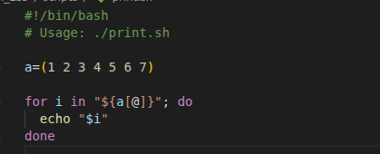
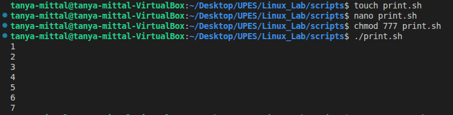

## Print Numbers

### Code

### Line by line Explanation

- #!/bin/bash
This is known as a shebang. It's the first line of the script and tells the operating system which interpreter to use to execute the file. In this case, it specifies the Bash shell.

- "# Usage: ./print.sh"
This is a comment. It's not executed but provides information,explaining how to run the script from the command line.

- a=(1 2 3 4 5 6 7)
This line initializes an array named a and assigns it the integer values from 1 to 7.

- for i in "${a[@]}"; do
This starts a for loop. It's designed to iterate over each element of the array a.
1. for i in: This sets up a loop where the variable i will hold the value of each element during each iteration.
2. "${a[@]}": This is a crucial part. It's the correct way to reference all elements of a bash array. The @ symbol inside the brackets, combined with the double quotes, expands the array into a list of its individual elements.

- echo "$i"
Inside the loop, this command prints the value of the current element to (your terminal).

-  done
This keyword marks the end of the for loop. Once the script has finished through all the elements in the array, it will exit the loop and continue with any code.

### Output

