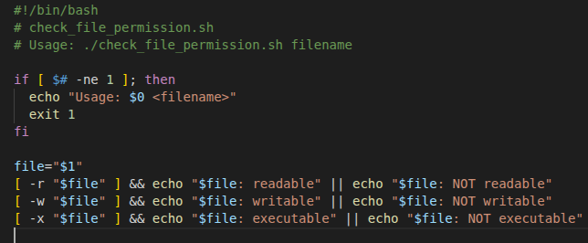

## Check_file_permission
 - The script takes one filename as input and tells you whether the current user has read, write, and execute permissions on it.

### Code


### Line By Line Explanation

```bash
#!/bin/bash
```
- The #!/bin/bash is called a shebang line.
- It tells the system to use /bin/bash to run the script.

```bash
# check_file_permission.sh
```
- This is a comment which tells the name of shell script

```bash
# Usage: ./check_file_permission.sh filename
```
- comment explaining how to run the script

```bash
if [ $# -ne 1 ]; then
```
- "$#" gives the number of command-line arguments passed to the script.
- -ne means “not equal to.”
-  So this checks: if the number of arguments is not equal to 1.

```bash
  echo "Usage: $0 <filename>"
```
- If the condition is true,this line prints a usage message.
- $0 is replaced by the name of the script itself, so the message looks like:
Usage: ./check_file_permission.sh <filename>

```bash
  exit 1
```
- Stops the script immediately with exit code 1 (which means error)

```bash
  fi
```
- Marks the end of the if statement.

```bash
  file="$1"
```
- Assigns the first argument (the filename provided by the user) to the variable file.
- $1 means “the first argument.”

```bash
  [ -r "$file" ] && echo "$file: readable" || echo "$file: NOT readable"
```
- [ -r "$file" ] checks if the file is readable by the user running the script.
- && means “if the previous command succeeds, then do this.”
- || means “else, do this.”
- So, if the file is readable → print filename: readable;Otherwise → print filename: NOT readable.

```bash
  [ -w "$file" ] && echo "$file: writable" || echo "$file: NOT writable"
```
- Similar logic, but checks writable permission with -w.
- If writable → filename: writable;Else → filename: NOT writable.


```bash
  [ -x "$file" ] && echo "$file: executable" || echo "$file: NOT executable"
```
- Similar again, but checks executable permission with -x.
- If executable → filename: executable;Else → filename: NOT executable.

### Output


