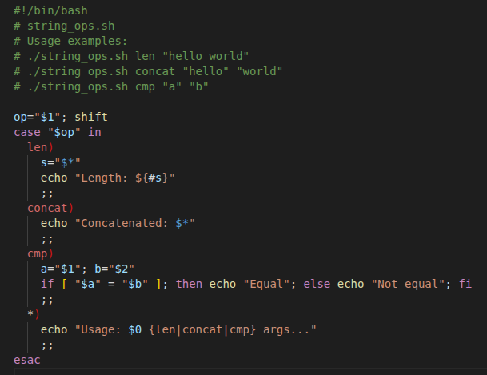
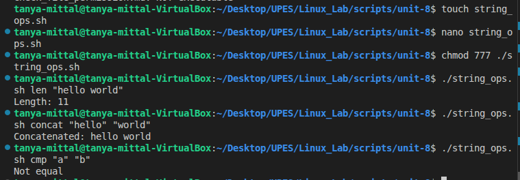

## String_length_comparison
- This script performs basic string operations depending on the first argument (len, concat, or cmp):
    - len "hello world" → prints the length of the string.
    - concat "hello" "world" → joins them into one string.
    - cmp "a" "b" → checks if the two strings are equal.
### Code


### Line By Line Explanation

```bash
#!/bin/bash
```
- Shebang line — tells the system to run the script using Bash.

```bash
# string_ops.sh
```
- Comment,indicates script's name 

```bash
# Usage examples:
# ./string_ops.sh len "hello world"
# ./string_ops.sh concat "hello" "world"
# ./string_ops.sh cmp "a" "b"
```
- Comment block explaining how to use the script:
    - len → find length of a string
    - concat → concatenate (join) strings
    - cmp → compare two strings

```bash
op="$1"; shift
```
- "$1" is the first argument passed to the script (operation name).
- Stored in variable op.
- shift removes the first argument, so $1, $2, etc. now refer only to the remaining ones.

```bash
case "$op" in
```
- Starts a case statement to check what operation (op) the user asked for.

```bash
  len)
    s="$*"
    echo "Length: ${#s}"
    ;;
```
- If op is len:
    -  s="$*" stores all remaining arguments as a single string.
    - ${#s} gives the length of the string s.
    - Prints: Length: number.
- ;; ends this case branch.

```bash
    concat)
    echo "Concatenated: $*"
    ;;
```
- If op is concat:
    - $* expands to all arguments separated by spaces.
    - Prints them as one string.
- Example: "hello" "world" → Concatenated: hello world.

```bash
    cmp)
    a="$1"; b="$2"
    if [ "$a" = "$b" ]; then echo "Equal"; else echo "Not equal"; fi
    ;;
```
- If op is cmp:
    - a="$1" (first string argument).
    - b="$2" (second string argument).
    - [ "$a" = "$b" ] compares the two strings.
    - If equal → prints Equal.
    - Else → prints Not equal.
- ;; ends this branch.

```bash
      *)
    echo "Usage: $0 {len|concat|cmp} args..."
    ;;
```
- "*" is the default case (if none of the above matched).
-  Prints usage instructions to guide the user.

```bash
    esac
```
-  Ends the case statement.

### Output 
